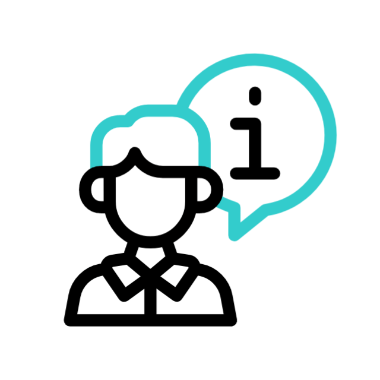
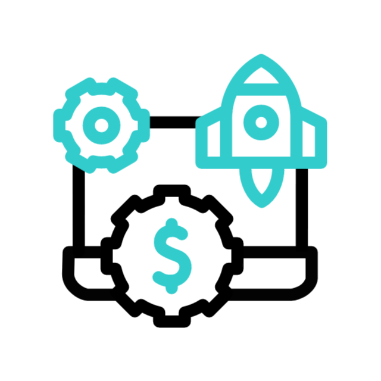
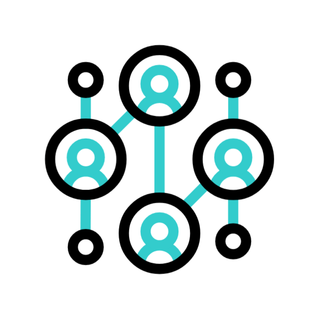

<!-- README.md -->

<h1 align="center">
  
</h1>

A passionate full-stack developer who blends <strong>web & desktop technologies</strong> with a touch of <strong>Python wizardry</strong>

---

##  - Tech Stack

  
  
  
  
  
  
  
  
  
  

---

<svg width="200" height="200" viewBox="0 0 200 200" xmlns="http://www.w3.org/2000/svg">
  <!-- Lingkaran jaring laba-laba -->
  <circle cx="100" cy="100" r="90" stroke="#0ff" stroke-width="1" fill="none" />
  <circle cx="100" cy="100" r="70" stroke="#0ff" stroke-width="1" fill="none" />
  <circle cx="100" cy="100" r="50" stroke="#0ff" stroke-width="1" fill="none" />
  <circle cx="100" cy="100" r="30" stroke="#0ff" stroke-width="1" fill="none" />
  <circle cx="100" cy="100" r="10" stroke="#0ff" stroke-width="1" fill="none" />
  
  <!-- Garis jaring laba-laba -->
  <line x1="100" y1="10" x2="100" y2="190" stroke="#0ff" stroke-width="1" />
  <line x1="10" y1="100" x2="190" y2="100" stroke="#0ff" stroke-width="1" />
  <line x1="35" y1="35" x2="165" y2="165" stroke="#0ff" stroke-width="1" />
  <line x1="165" y1="35" x2="35" y2="165" stroke="#0ff" stroke-width="1" />
  
  <!-- Animasi putar lambat -->
  <animateTransform 
    attributeName="transform" 
    attributeType="XML" 
    type="rotate" 
    from="0 100 100" 
    to="360 100 100" 
    dur="60s" 
    repeatCount="indefinite" />
</svg>

---

##  - About Me

- 🔧 Building **Next.js** apps with **TypeScript** + GraphQL  
- 🧪 Creating **penetration testing** and **vision-based** desktop tools in **Python**  
- 🔌 Developing chat, video, and screen-sharing tools with **Electron & WebRTC**  
- 🤖 Passionate about AI, gesture control, and turning coffee into software

---

##  - Featured Projects

| Project | Description |
|--------|-------------|
|  **Financial Management System** | Scalable platform for managing business & personal finances |
|  **Hospital Information System (SIMRS)** | Robust system for managing hospital operations |
|  **Sales Information System** | All-in-one solution for sales, inventory & reporting |
|  **Real-time Chat & Video Call App** | Web & desktop communication tools with WebRTC |
|  **English Learning App** | Interactive language learning with fun UX |
|  **Security Penetration Tools** | Python-based ethical hacking & testing tools |
|  **Face & Hand Gesture Recognition** | Desktop app for gesture-based UI control |

---

##  - Let's Connect

  
  &nbsp;&nbsp;
  
  &nbsp;&nbsp;
  

---

  

  <em>"If God ordained that humans sleep only three hours, I would dedicate every remaining moment to unraveling the mysteries of nature, until technology transcends the limits of time." — me 2024</em> 
  <small>"Andai Tuhan menetapkan manusia hanya tidur tiga jam, niscaya aku akan mendedikasikan setiap detik tersisa untuk menyingkap rahasia alam semesta, hingga tercipta teknologi yang melampaui batas waktu."</small>

